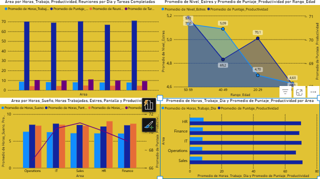

## Analisis de productividad de empleados

Este proyecto analiza el archivo `productividad_empleados.csv` con Python + Pandas.

El enfoque se centra en responder 7 preguntas de negocio:

1. Promedio de sueno, horas de trabajo, estres y tiempo de pantalla.
2. Promedio de reuniones y tareas completadas.
3. Rango de edad con mayor estres promedio.
4. Rango de edad con mayor y menor productividad promedio.
5. Area con mas horas, reuniones, tareas y productividad.
6. Promedio por area de sueno, estres, pantalla, horas y productividad.
7. Rango de edad mas cercano a 8 horas de sueno con productividad alta, y sus horas, tareas y reuniones.

### Datos de entrada

- Archivo principal: `productividad_empleados.csv`
- Cada fila es un empleado.
- Columnas principales:
  - `Department`: area (Finance, Sales, HR, IT, Operations).
  - `Age`: edad del empleado.
  - `Work_Hours_Per_Day`: horas trabajadas por dia.
  - `Meetings_Per_Day`: numero de reuniones diarias.
  - `Screen_Time_Hours`: horas frente a pantalla.
  - `Sleep_Hours`: horas de sueno.
  - `Stress_Level`: nivel de estres (1 a 9).
  - `Tasks_Completed`: tareas completadas.
  - `Productivity_Score`: puntaje de productividad.

### Script de analisis

El analisis principal esta en `analisis_productividad.py`.

El script:

- Lee el CSV en `dt`.
- Crea rangos de edad: `20-29`, `30-39`, `40-49`, `50-59`.
- Calcula metricas generales y por segmentacion.
- Responde de forma directa las 7 preguntas.
- Genera un reporte final en `analisis_productividad.txt`.
- Limpia y exporta el dataset a `Data_analysis.xlsx`.

Para ejecutar el analisis:

```bash
python analisis_productividad.py
```

Esto crea (o actualiza) `analisis_productividad.txt` con:

- Respuestas a las 7 preguntas (con numeros reales).
- Recomendaciones para tomar decisiones.
- Que mostrar en Power BI.

<<<<<<< HEAD
=======
###Analisis Visual (Power Bi)


>>>>>>> 4b2d4007dbf312eef1e8537b43c8787dc5203434
Tambien crea:

- `Data_analysis.xlsx` (hoja `Datos_Limpios`) con columnas en espanol:
  - `Area`, `Edad`, `Horas_Trabajo_Dia`, `Reuniones_Dia`, `Horas_Pantalla`,
    `Horas_Sueno`, `Nivel_Estres`, `Tareas_Completadas`,
    `Puntaje_Productividad`, `Rango_Edad`.
  - La columna `Employee_ID` se excluye en la salida limpia.

### Estructura del reporte final (`analisis_productividad.txt`)

- Pregunta 1 a Pregunta 7 con respuesta numerica.
- Tabla por area para sueno, estres, pantalla, horas y productividad.
- Recomendaciones para solucionar el problema.
- Lista de visuales sugeridos para Power BI.

### Recomendacion de uso

1. Ejecuta el script.
2. Abre el `.txt` y valida las respuestas.
3. Lleva las metricas a Power BI con los visuales sugeridos.

